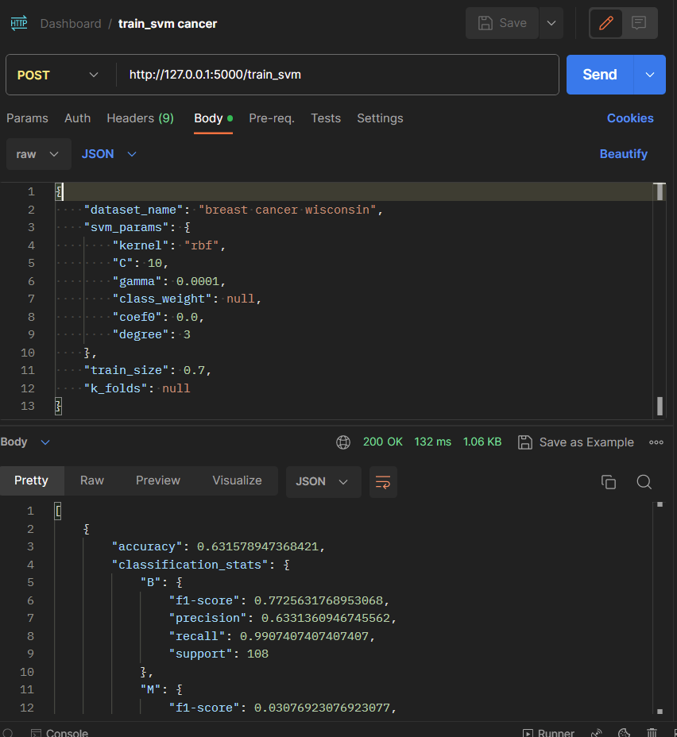

# EducativeMLDashbaord

## Frontend Installation
### 1. Install Node.js and NPM, follow these instructions:
- Mac-OS: https://www.newline.co/@Adele/how-to-install-nodejs-and-npm-on-macos--22782681
- WIndows: https://phoenixnap.com/kb/install-node-js-npm-on-windows

Node.js is a javascript runtime environment. NPM (Node Package Manager) is the default package manager for Node.js, used for installing, and managing packages, modules, and libraries.

### 2. Install Packages:
- Navigate to the frontend directory:

    `cd frontend`
- Install packages (list of packages are listed in package.json):
  
    `npm install`
  
This will generate a node_modules directory, and DO NOT push this directory to the repository (this directory is included in the .gitignore). You can also run `npm install` to update or reinstall any required packages.

### 3. Run the development server:
- Navigate to the frontend directory (if you aren't there already):
  
    `cd frontend`
- Run the "start" script:
  
    `npm start`
  
By default, the development server runs on http://localhost:3000.
    
## Backend
### 1. Install required python libraries
```commandline
pip install -r requirements.txt
```

### 2. Run backend server python file
```commandline
cd backend/
python3 ml_dashboard_server.py
```

### 3. Do REST api testing using Postman
Take the method train_svm() as an example.
```python
@app.route('/train_svm', methods=['POST'])
def train_svm():
    ...
```
Fill in the whole url for this endpoint and select POST HTTP request as the methods indicated.
```
http://127.0.0.1:5000/train_svm
```
Also need to fill in the body with JSON as the api required
```json
{
  "dataset_name": "breast cancer wisconsin",
  "svm_params": {
    "kernel": "rbf",
    "C": 10,
    "gamma": 0.0001,
    "class_weight": null,
    "coef0": 0.0,
    "degree": 3
  },
  "train_size": 0.7,
  "k_folds": null
}
```
After you click "Send" button, the server will send the feedback JSON.
