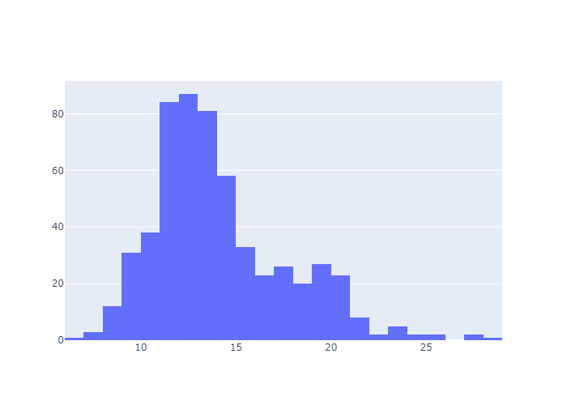
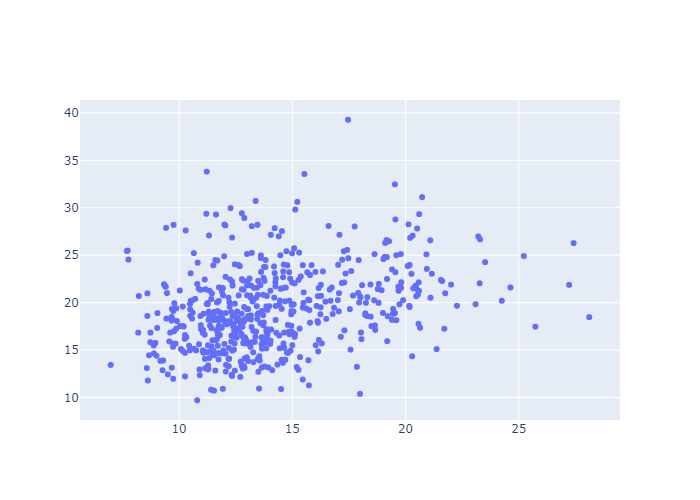
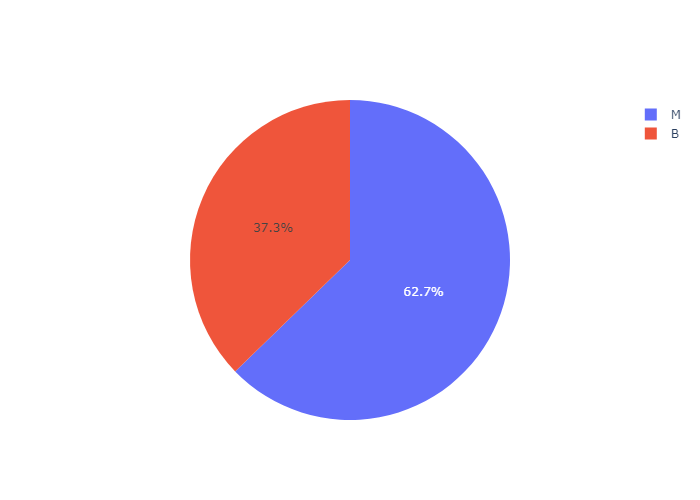
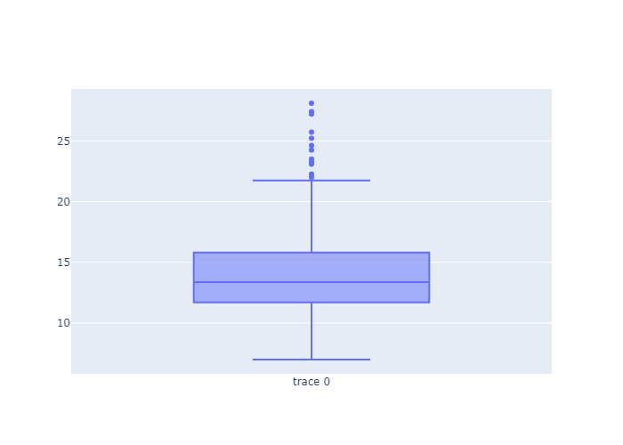

# API Documentation

## 1. POST /load_data
Load the dataset and store its name, target column, and feature columns into session. Return a message or error with target column and feature columns.

### Request

**Endpoint:** `/load_data`

**Method:** POST

return the feature columns names and target column name. Also returns two sets of default config, one is the baseline,
the other one is the optimal config.

### Request JSON Example:

```json
{
    "dataset_name": "ionosphere"
}
```

### Response
**Status Code:** 200 OK
```json
{
    "baseline_config": {
        "SVM_parameters": {
            "C": 10,
            "coef0": 0.0,
            "degree": 3,
            "gamma": 0.0001,
            "kernel": "linear"
        },
        "feature_selection": {...}
    },
    "error": null,
    "feature_columns": [...],
    "message": "Import data successfully.",
    "optimal_config": {
        "SVM_parameters": {
            "C": 10,
            "coef0": 0.0,
            "degree": 3,
            "gamma": 0.1,
            "kernel": "rbf"
        },
        "feature_selection": {...}
    },
    "target_column": "class"
}
```

**Status Code:** 400 Bad
```json
{
    "message": null,
    "error": "Dataset name not recognized.",
    "feature_columns": null,
    "target_column": null
}
```

## 2. POST /plot
Select features, plot type, and generate a chart using data stored in the session.

### Request

**Endpoint:** `/plot`

**Method:** POST

* feature_x - String, Name of the first feature to select
* feature_y - String, Name of the second feature to select (optional)
* plot_type - String, Type of the plot to select ("histogram" or "line")

### Request JSON Examples:
**Example 1**
```json
{
    "feature_x": "radius_mean",
    "feature_y": "texture_mean",
    "plot_type": "scatter"
}
```

**Example 2**
```json
{
    "feature_x": "radius_mean",
    "feature_y": null,
    "plot_type": "histogram"
}
```

### Response
**Status Code:** 200 OK
```json
{
    "message": "Plot generated successfully.",
    "error": null,
    "data": {
        "data": [{
            "x":[1,2,3], 
            "y":[1,2,3], 
            "mode":"scatter"
            }]
        }
}
```

```json
{
    "message": "Plot generated successfully.",
    "error": null,
    "data": {
        "data": [{
            "x":[1,2,3], 
            "mode":"histogram"
            }]
        }
}
```

**Status Code:** 400 Bad
```json
{
    "message": null,
    "error": "Failed to generate plot.",
    "data": null
}
```

**Response JSON Plots:**









## 5. POST /train_svm
Send the SVM training parameters, and get the trained SVM model attributes.

### Request

**Endpoint:** `/train_svm`

**Method:** POST

* dataset_name - String, Name of the dataset range in ['breast cancer wisconsin', 'ionosphere', 'penguins size']
* svm_params - All arguments that need to be passed into the SVC() model, all are optional. Detailed documentation: https://scikit-learn.org/stable/modules/generated/sklearn.svm.SVC.html
  * C - float, default=1.0, must be positive
  * kernel - String, default=’rbf’, range in [‘linear’, ‘poly’, ‘rbf’, ‘sigmoid’, ‘precomputed’]
  * degree - int, default=3, must be non-negative
  * gamma - default=’scale’, float or [‘scale’, ‘auto’], if float, must be non-negative.
  * coef0 - float, default=0.0, 
* train_size - float, must be positive and smaller than 1.0
* k_folds - int, must be greater or equal to 2.
* selected_features - a dictionary of all feature_column_names: true/false (been selected)

If both train_size and k_folds is not null, will use k_folds
### Request JSON Example:

```json
{
  "dataset_name": "breast cancer wisconsin",
  "svm_params": {
    "kernel": "rbf",
    "C": 10,
    "gamma": 0.0001,
    "class_weight": null,
    "coef0": 0.0,
    "degree": 3
  },
  "train_size": 0.7,
  "k_folds": null,
  "selected_features": {
    "radius_mean": true,
    "texture_mean": false,
    "perimeter_mean": false,
    "area_mean": true,
    ...
  }
}
```

### Response

| Field               | Data Type | Description                                                                                                                                                                                                   |
|---------------------|-----------|---------------------------------------------------------------------------------------------------------------------------------------------------------------------------------------------------------------|
| accuracy            | Float     | The accuracy of the model.                                                                                                                                                                                    |
| recall              | Float     | The recall of the model.                                                                                                                                                                                      |
| precision           | Float     | The precision of the model.                                                                                                                                                                                   |
| f1_score            | Float     | The F1 score of the model.                                                                                                                                                                                    |
| confusion_matrix    | 2D list   | Confusion matrix                                                                                                                                                                                              |
| roc_curve_plot_json | String    | A JSON string representing a Plotly figure for the ROC curve. This string, when parsed, returns a dictionary that can be passed to the `plotly.graph_objects.Figure` constructor to generate a Plotly figure. |

**Response JSON Example:**
**Status Code:** 200 OK
```json
{
    "avg_accuracy": 0.9296693060083838,
    "highest_accuracy_result": {
        "accuracy": 0.9649122807017544,
        "confusion_matrix_plot_json": "{\"data\":[{\"showscale\":false,\"x\":[\"Predicted Negative\",\"Predicted Positive\"],\"y\":[\"Actual Negative\",\"Actual Positive\"],\"z\":[[84,1],[3,26]],\"type\":\"heatmap\"}],\"layout\":{}}",
        "f1_score": 0.9526578073089701,
        "precision": 0.9642401021711366,
        "recall": 0.9423935091277891,
        "roc_curve_plot_json": "{\"data\":[{\"mode\":\"lines\",\"name\":\"ROC curve (area = 0.99)\",\"x\":[0.0,0.0,0.0,0.03529411764705882,0.03529411764705882,0.23529411764705882,0.23529411764705882,1.0],\"y\":[0.0,0.034482758620689655,0.896551724137931,0.896551724137931,0.9655172413793104,0.9655172413793104,1.0,1.0],\"type\":\"scatter\"},{\"mode\":\"lines\",\"name\":\"Random\",\"x\":[0,1],\"y\":[0,1],\"type\":\"scatter\"}],\"layout\":{}}"
        }
    }
```


**Status Code:** 400 Bad (in development)
```json
{
    "error": "Something wrong in the training process."
}
```

# 6. POST /session

Debug endpoint, get all the key-value pairs in the session.

### Request

**Endpoint:** `/session`

**Method:** POST


### Response
**Status Code:** 200 OK

**Response JSON Example:**
```json
{
    "message": "Import data successfully."
}
```